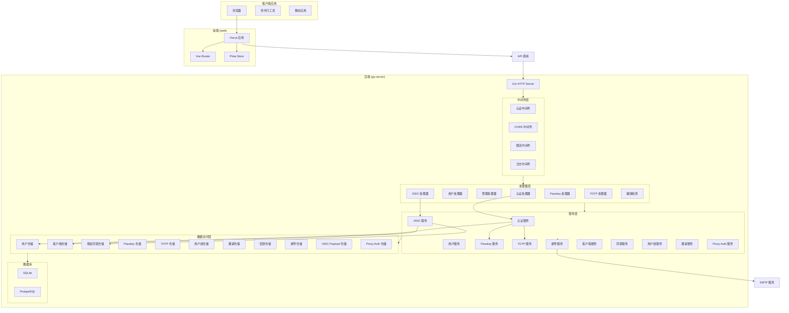
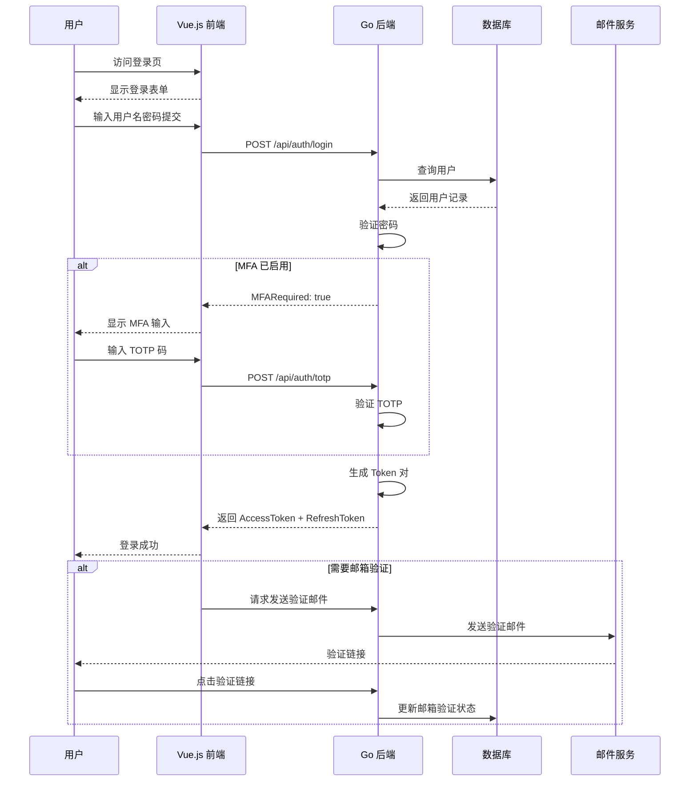
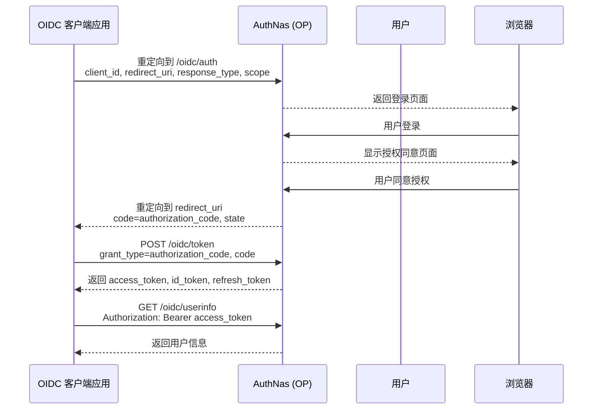
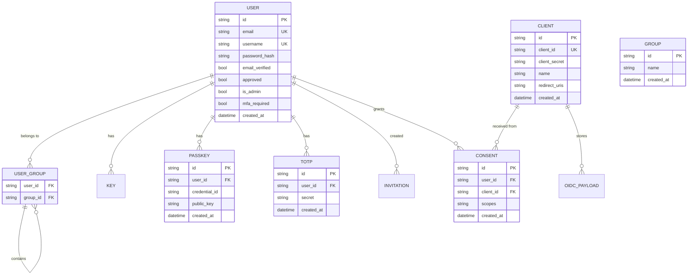

# AuthNas 系统架构

## 概述

AuthNas 是一个开源的 SSO（单点登录）认证和用户管理系统，旨在为自托管应用程序提供统一的身份认证服务。该系统采用前后端分离架构，后端使用 Go 语言编写，前端使用 Vue.js 构建。

AuthNas 的主要职责是作为身份提供者（Identity Provider），通过标准化的 OIDC 协议为各种自托管应用提供认证服务。系统支持多种认证方式，包括传统的用户名密码、Passkeys（通行密钥）和 TOTP 多因素认证。

系统架构遵循分层设计原则，将展示层、业务逻辑层和数据访问层清晰分离。后端采用 Gin 框架提供 HTTP API，前端采用 Vue 3 + TypeScript 构建单页应用，通过 Pinia 进行状态管理。

## 技术栈

### 后端（go-server）

**语言与运行时**
- Go 1.25+

**框架与库**
- Gin - Web 框架
- GORM - ORM 库
- go-webauthn - Passkey 支持
- golang-jwt/jwt/v5 - JWT 令牌处理
- viper - 配置管理

**数据存储**
- SQLite（开发默认）
- PostgreSQL（生产推荐）

### 前端（web）

**语言与框架**
- TypeScript
- Vue 3.5+
- Vue Router 4
- Pinia 2

**UI 组件**
- Naive UI 2.x

**工具链**
- Vite 8
- Vitest（测试）
- Playwright（E2E 测试）

## 项目结构

```
authnas/
├── go-server/                              # Go 后端服务
│   ├── cmd/server/                         # 应用入口
│   │   └── main.go                         # 主函数
│   ├── internal/                           # 内部包（不可外部导入）
│   │   ├── config/                         # 配置管理
│   │   │   └── config.go                   # 配置加载和验证
│   │   ├── crypto/                         # 密码学工具
│   │   ├── database/                       # 数据库层
│   │   │   ├── sqlite.go                   # SQLite 连接
│   │   │   └── migrations/                 # 数据库迁移文件
│   │   ├── handler/                        # HTTP 处理器
│   │   │   ├── admin.go                    # 管理后台结构体和路由注册
│   │   │   ├── admin_user.go               # 用户管理处理器
│   │   │   ├── admin_group.go              # 用户组管理处理器
│   │   │   ├── admin_client.go             # OAuth 客户端管理处理器
│   │   │   ├── admin_invitation.go         # 邀请管理处理器
│   │   │   ├── admin_proxy_auth.go         # Proxy Auth 管理处理器
│   │   │   ├── auth.go                     # 认证处理器
│   │   │   ├── health.go                   # 健康检查
│   │   │   ├── oidc.go                     # OIDC 协议处理器
│   │   │   ├── passkey.go                  # Passkey 处理器
│   │   │   ├── totp.go                     # TOTP 处理器
│   │   │   └── user.go                     # 用户管理处理器
│   │   ├── middleware/                      # 中间件
│   │   ├── model/                          # 数据模型
│   │   │   ├── client.go                   # OIDC 客户端模型
│   │   │   ├── consent.go                  # 授权同意模型
│   │   │   ├── email.go                    # 邮件模型
│   │   │   ├── group.go                    # 用户组模型
│   │   │   ├── invitation.go              # 邀请模型
│   │   │   ├── key.go                      # 密钥模型
│   │   │   ├── oidc_payload.go             # OIDC 会话数据模型
│   │   │   ├── passkey.go                  # Passkey 模型
│   │   │   ├── proxy_auth.go               # Proxy Auth 模型
│   │   │   ├── totp.go                     # TOTP 模型
│   │   │   ├── user.go                     # 用户模型
│   │   │   └── user_group.go               # 用户组关联模型
│   │   ├── oidc/                           # OIDC 协议实现
│   │   ├── repository/                      # 数据访问层
│   │   │   ├── client_repo.go              # 客户端仓储
│   │   │   ├── consent_repo.go             # 同意仓储
│   │   │   ├── email_repo.go               # 邮件仓储
│   │   │   ├── group_repo.go               # 用户组仓储
│   │   │   ├── invitation_repo.go          # 邀请仓储
│   │   │   ├── key_repo.go                 # 密钥仓储
│   │   │   ├── oidc_payload_repo.go        # OIDC Payload 仓储
│   │   │   ├── passkey_repo.go             # Passkey 仓储
│   │   │   ├── proxy_auth_repo.go          # Proxy Auth 仓储
│   │   │   ├── totp_repo.go                # TOTP 仓储
│   │   │   └── user_repo.go                # 用户仓储
│   │   └── service/                        # 业务逻辑层
│   │       ├── auth_service.go             # 认证服务
│   │       ├── user_service.go             # 用户服务
│   │       ├── oidc_service.go             # OIDC 服务
│   │       ├── passkey_service.go          # Passkey 服务
│   │       ├── totp_service.go             # TOTP 服务
│   │       ├── email_service.go            # 邮件服务
│   │       ├── client_service.go           # 客户端服务
│   │       ├── consent_service.go           # 同意服务
│   │       ├── group_service.go            # 用户组服务
│   │       ├── invitation_service.go       # 邀请服务
│   │       └── proxy_auth_service.go        # Proxy Auth 服务
│   └── pkg/                                # 公共包（可外部导入）
│       ├── database/                       # 数据库工具
│       ├── email/                          # 邮件发送
│       └── utils/                          # 工具函数
│
└── web/                                    # Vue.js 前端
    ├── src/
    │   ├── api/                            # API 调用
    │   ├── components/                     # 公共组件
    │   ├── router/                         # 路由配置
    │   ├── stores/                         # Pinia 状态管理
    │   ├── views/                          # 页面视图
    │   ├── types/                          # TypeScript 类型
    │   └── main.ts                         # 前端入口
    └── public/                             # 静态资源
```

## 子系统

### 认证子系统（Auth Service）

**目的**: 处理用户认证相关的核心逻辑

**位置**: `go-server/internal/service/auth_service.go`

**关键功能**:
- 用户登录/登出
- 密码验证与强度检查
- 登录锁定保护
- Token 生成与刷新
- 会话管理

**依赖**: User Repository、Key Repository、TOTP Repository

### OIDC 子系统（OIDC Service）

**目的**: 实现 OpenID Connect 协议

**位置**: `go-server/internal/service/oidc_service.go`

**关键功能**:
- OIDC 发现端点（/.well-known/openid-configuration）
- JWKS 端点（/jwks）
- 授权端点（/authorize）
- Token 端点（/token）
- UserInfo 端点
- 授权码交换

**依赖**: Client Repository、Consent Repository、User Repository

### Passkey 子系统（Passkey Service）

**目的**: 处理 WebAuthn/Passkey 认证

**位置**: `go-server/internal/service/passkey_service.go`

**关键功能**:
- Passkey 注册
- Passkey 认证验证
- 凭证管理

**依赖**: Passkey Repository、User Repository

### 用户管理子系统（User Service）

**目的**: 用户生命周期管理

**位置**: `go-server/internal/service/user_service.go`

**关键功能**:
- 用户创建、查询、更新、删除
- 邮箱验证
- 密码重置
- 用户组管理
- 初始管理员创建

**依赖**: User Repository、Group Repository、Email Service

### 前端应用（Web）

**目的**: 用户交互界面

**位置**: `web/src/`

**关键功能**:
- 登录/注册界面
- 用户个人资料管理
- 安全设置（Passkeys、TOTP）
- 管理后台（用户、组、客户端、邀请管理）
- OIDC 授权同意页面

## 系统架构图



## 用户认证流程



## OIDC 授权码流程



## 数据库模型关系


