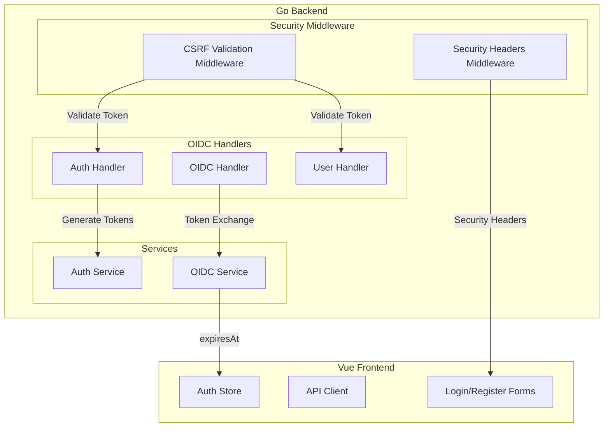

# Security Enhancements Design

Feature Name: 2025-04-24-security-enhancements
Updated: 2025-04-24

## Description

Implement four security features: CSRF protection, refresh token rotation with explicit expiresAt, Single Logout (SLO), and HTTP security headers.

## Architecture



## Components and Interfaces

### 1. HTTP Security Headers Middleware

**File:** `internal/middleware/security_headers.go`

```go
type SecurityHeadersConfig struct {
    EnableHSTS          bool
    HSTSMaxAge          int
    EnableXFrameOptions bool
    XFrameOptions       string  // DENY or SAMEORIGIN
    EnableCSP           bool
    CSPPolicy           string
    EnableXContentType  bool
    EnableReferrerPolicy bool
    ReferrerPolicy      string
}
```

**Headers Set:**
- `Strict-Transport-Security`: `max-age=<maxAge>; includeSubDomains`
- `X-Content-Type-Options`: `nosniff`
- `X-Frame-Options`: `DENY` or `SAMEORIGIN`
- `Content-Security-Policy`: Configurable policy
- `Referrer-Policy`: `strict-origin-when-cross-origin`
- `Permissions-Policy`: `camera=(), microphone=(), geolocation=()`

### 2. CSRF Protection

**New Endpoint:** `GET /auth/csrf` - Returns CSRF token

**Response:**
```json
{
  "token": "cryptographically-secure-token",
  "expiresAt": "2025-04-24T12:00:00Z"
}
```

**Implementation:**
1. Store CSRF token in secure HTTP-only cookie (not localStorage)
2. Also return token in JSON for form submission
3. Validate token on state-changing requests (POST, PUT, DELETE, PATCH)
4. Double-submit cookie pattern for additional safety

**Cookie Settings:**
- `HttpOnly: true` (prevent XSS access)
- `Secure: true` (HTTPS only in production)
- `SameSite: Strict` (strict same-site cookies)

**Frontend Changes:**
- On form load, fetch CSRF token from `/auth/csrf`
- Include token in request header `X-CSRF-Token`
- Include token as hidden field in forms

### 3. Refresh Token Rotation with expiresAt

**Backend Changes in `TokenResponse`:**

```go
type TokenResponse struct {
    AccessToken  string `json:"accessToken"`
    TokenType    string `json:"tokenType"`
    ExpiresIn    int    `json:"expiresIn"`
    ExpiresAt    string `json:"expiresAt"`    // NEW: ISO 8601 format
    RefreshToken string `json:"refreshToken"`
    IDToken      string `json:"idToken"`
    Scope        string `json:"scope"`
}
```

**Frontend Changes in `auth.ts`:**

```typescript
// Parse expiresAt from response
if (response.data.data?.expiresAt) {
  const expiresAt = new Date(response.data.data.expiresAt)
  // Store and use for expiration detection
}
```

### 4. Single Logout (SLO)

**New Endpoints:**

1. `GET /oidc/endsession` - Front-channel logout initiation
2. `POST /oidc/backchannel-logout` - Back-channel logout receiver

**endsession endpoint response:**
- Returns HTML page with iframes to notify client apps
- Or redirects to `post_logout_redirect_uri`

**backchannel-logout receiver:**
- Validates `logout_token` parameter (OIDC back-channel logout token)
- Revokes the session
- Returns 200 OK

**Discovery document update:**
```json
{
  "endsession_endpoint": "http://localhost:8080/oidc/endsession",
  "backchannel_logout_supported": true,
  "backchannel_logout_uri_supported": true
}
```

## Data Models

### CSRF Token Storage (In-Memory)

```go
type CSRFToken struct {
    Token     string
    UserID   string
    CreatedAt time.Time
    ExpiresAt time.Time
}
```

### Back-Channel Logout Token (JWT Claims)

```go
type BackChannelLogoutClaims struct {
    iss    string  // Issuer
    sub    string  // Subject (user ID)
    aud    string  // Audience (client ID)
    iat    int64   // Issued at
    jti    string  // JWT ID for replay prevention
    events map[string]interface{}  // {"http://schemas.openid.net/event/backchannel-logout": {}}
}
```

## Correctness Properties

1. **CSRF tokens are unguessable**: Use 32-byte cryptographically secure random tokens
2. **CSRF tokens expire**: Default 1-hour expiry, configurable
3. **Refresh token rotation is atomic**: Old token deletion and new token creation in single transaction
4. **SLO notifications are reliable**: Use retry mechanism for back-channel logout
5. **Security headers don't break functionality**: Test with all API endpoints

## Error Handling

| Scenario | HTTP Status | Response |
|----------|-------------|----------|
| Invalid CSRF token | 403 | `{"error": "csrf_token_invalid"}` |
| Expired CSRF token | 403 | `{"error": "csrf_token_expired"}` |
| Missing CSRF token | 403 | `{"error": "csrf_token_required"}` |
| Invalid back-channel logout token | 400 | `{"error": "invalid_logout_token"}` |

## Test Strategy

1. **Unit Tests**: Test CSRF token generation, validation, rotation logic
2. **Integration Tests**: Test full flow with actual HTTP requests
3. **E2E Tests**: Test user login/logout flows with Playwright
4. **Security Tests**: Verify headers are present and correct using curl

## Implementation Order

1. HTTP Security Headers (middleware, no dependencies)
2. CSRF Protection (backend endpoint + middleware)
3. Refresh Token expiresAt (backend response + frontend parsing)
4. Single Logout (requires OIDC service changes)
